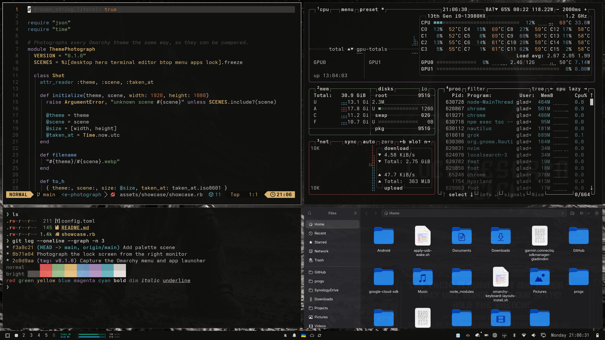

[](https://github.com/tcballard/omarchy-badges)

# Loca Deserta Dark

```bash
omarchy theme install https://github.com/gladimdim/omarchy-loca-deserta-dark-theme.git
omarchy theme set "Loca Deserta Dark"
```

An [Omarchy](https://omarchy.org) theme for the far-future **Loca Deserta** universe:
the Hetmanate Federation, its heavy assault Terminators, and the void between stars.



Companion theme: [Loca Deserta Light](https://github.com/gladimdim/omarchy-loca-deserta-light-theme).

## Palette

Derived from the Terminator universe illustrations: carbon void space, battle-plate steel,
lunar regolith, and starlight corona highlights.

| Role       | Hex       | Source                                   |
|------------|-----------|------------------------------------------|
| background | `#10100f` | carbon void, deep lunar shadow           |
| foreground | `#d1cdc9` | Terminator battle-plate, lunar regolith  |
| accent     | `#ece8e5` | starlight corona, pinpoint glare         |
| yellow     | `#dbb471` | weathered brass, hazard markings         |
| orange     | `#d47844` | muzzle flare, engine burn                |
| red        | `#d95750` | targeting laser, combat warning          |
| green      | `#88ad7c` | tactical HUD phosphor, night optics      |
| cyan       | `#5ca3ad` | plasma bolt                              |
| blue       | `#6b93b8` | cold void, tempered steel                |
| magenta    | `#a688b5` | sensor bloom, ion wake                   |

Active window borders run a 45° gradient from starlight corona white to weathered titanium plate.

## Backgrounds

Hetmanate Terminator assault troopers on lunar / airless asteroid combat operations, each featuring universe lore quotes framed in tactical sci-fi HUD panels:

1. `Background.webp` — Terminator infantry rifleman Danylo Morozenko with Kodak Orbital Bastion quote
2. `Terminator-2.webp` — Terminator mounted Sotnyk Omelian Nechypura with Perekop Frontier quote
3. `Terminators-3.webp` — Terminator cavalry squadron charging across lunar plains with Kodak Orbital Bastion quote
4. `Terminators-4.webp` — Trio of heavy Cossack Terminator cyber-cavalry galloping with Taras Honta quote
5. `Terminator-5.webp` — Heavy Terminator cyber-lancer charging into the fray with Lukash Zhuravel quote
6. `Trio-Terminator.webp` — Trio of heavy Cossack Terminator cyber-cavalry with Otaman Petro Perebyinis quote

Cycle with `omarchy theme bg next`.

## Credits

Art and universe by Dmytro Gladkyi, from the
[Loca Deserta SciFi](https://github.com/gladimdim/LocaDesertaSciFi) vault.
